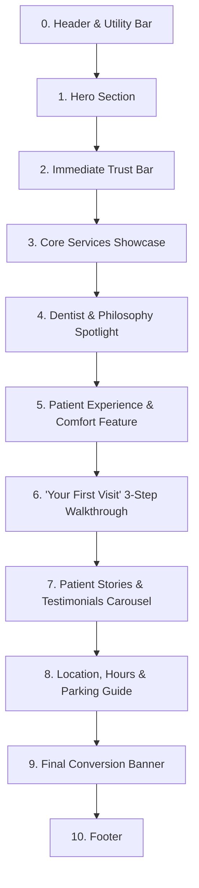

# Homepage UX/UI Specification: Aura Dental Studio

> **Document Status**: Approved Specification Baseline  
> **Project Phase**: Phase 4 — Homepage UX/UI Specification  
> **Target Application**: Dentist Portfolio Website (`dentist-portfolio-website`)

---

## 1. Homepage Objective

The primary objective of the Aura Dental Studio homepage is to convert high-intent prospective patients into confirmed appointments while reducing dental anxiety and establishing instant brand authority.

### Core Conversion & Psychological Strategy
1. **Immediate Positioning**: Communicate within 3 seconds that Aura Dental Studio is a modern, gentle, design-led dental clinic in Downtown Austin.
2. **Anxiety Reduction**: Reassure patients through warm tone, transparent pricing, non-judgmental philosophy, and luxury comfort amenities (headphones, warm towels, gentle care).
3. **Trust & Credibility**: Highlight Dr. Elena Rostova's credentials, 15+ years of clinical experience, 3D technology, and verified community feedback.
4. **Frictionless Conversion**: Provide a persistent, clear primary CTA (`Book Appointment`) accessible from any viewport height without aggressive popups.

---

## 2. Homepage Section Inventory & Sequence



### Section Breakdown & Hierarchy

| Sec # | Section Name | Target User Question | Primary Objective | Primary Action / CTA | Trust Function | Background Tonal Fill |
| :--- | :--- | :--- | :--- | :--- | :--- | :--- |
| **0** | **Header & Utility Top-Bar** | *"Is this clinic open and how do I contact them?"* | Provide immediate contact points and global nav navigation. | `Book Online` (Accent Pill) | Brand authority & instant phone access | Warm Alabaster (`#FBF9F5`) |
| **1** | **Hero Section** | *"Is this clinic right for me, and can I trust them?"* | Communicate positioning, value proposition, and drive initial booking. | `Book Appointment` | Instant professional credentials & warmth | Warm Alabaster (`#FBF9F5`) |
| **2** | **Immediate Trust Bar** | *"Are they reputable and experienced?"* | Provide instant social and clinical proof without clutter. | None (Passive trust) | Rating highlight (4.9★), 15+ Yrs Exp, Same-Day Crowns | Soft Linen (`#F4F0E8`) |
| **3** | **Core Services Showcase** | *"Do they provide the specific treatment I need?"* | Showcase 4 primary service categories with benefits and fee ranges. | `Explore All Services` | Clear clinical capability & transparent pricing | Pristine White (`#FFFFFF`) |
| **4** | **Dentist Spotlight** | *"Who will be taking care of my teeth?"* | Humanize the clinic and showcase Dr. Elena Rostova's expertise. | `Meet Our Full Team` | Personal empathy, DDS/FAGD credentials | Warm Alabaster (`#FBF9F5`) |
| **5** | **Patient Experience & Comfort**| *"Will it hurt or feel intimidating?"* | Relieve dental anxiety by highlighting soothing amenities. | `Explore Comfort Care` | Pain-free philosophy & amenity bar | Soft Linen (`#F4F0E8`) |
| **6** | **"First Visit" Walkthrough** | *"What happens when I show up for the first time?"* | Eliminate fear of the unknown with a 3-step visit preview. | `Schedule Your First Visit` | Process transparency & predictability | Pristine White (`#FFFFFF`) |
| **7** | **Patient Stories Carousel** | *"What do real patients say about their visits?"* | Provide social proof through authentic patient feedback. | `Read More Reviews` | Verified community validation | Warm Alabaster (`#FBF9F5`) |
| **8** | **Location & Access** | *"Where is the clinic and where do I park?"* | Confirm geographic convenience and transit details. | `Get Directions` | Physical legitimacy & parking guidance | Soft Linen (`#F4F0E8`) |
| **9** | **Final Conversion Banner** | *"I'm ready—how do I get started?"* | Capture remaining intent with a strong closing invitation. | `Book Your Appointment Now` | Final conversion prompt | Forest Jade (`#0D3B36`) |

---

## 3. Section Specifications

### 3.1 Hero Section Specification
* **Eyebrow Label**: `DOWNTOWN AUSTIN DENTAL STUDIO` (12px uppercase, tracking `0.1em`, Forest Jade `#0D3B36`).
* **Headline Structure**: *"Modern, gentle dentistry designed around your comfort, schedule, and confidence."* (Serif *Cormorant Garamond*, 56px desktop / 36px mobile, bold 700, `#1C1917`).
* **Supporting Paragraph**: *"Experience stress-free oral care with transparent pricing, 3D digital precision, and soothing comfort amenities in a warm, design-forward environment."* (Sans-serif *Plus Jakarta Sans*, 18px, `#44403C`, max-width `540px`).
* **CTAs**:
  * Primary: `Book Appointment` (Solid Forest Jade `#0D3B36`, white text, 8px radius, 14px 28px padding).
  * Secondary: `Explore Services` (Outline Soft Linen `#E7E2D8`, charcoal text).
* **Trust Microcopy**: `✓ 24/7 Self-Service Booking • Instant Confirmation • No Surprise Fees`
* **Imagery Concept**: Architectural portrait of Dr. Rostova in a sunlit operatory, interacting warmly with a patient. Rounded 16px frame with subtle Sandalwood Gold accent border (`#D4A373`).

### 3.2 Header Specification
* **Desktop Top Utility Bar**: Height 36px, Soft Linen fill (`#F4F0E8`). Left: `📍 410 Congress Ave, Suite 200, Austin, TX`. Right: `📞 Emergency Triage: (512) 555-0199 | Mon-Fri: 7:00 AM - 6:00 PM`.
* **Main Header Bar**: Height 72px, sticky with backdrop blur (`backdrop-blur-md bg-[#FBF9F5]/90`). Logo left, navigation center (`About`, `Services`, `Experience`, `Reviews`, `Contact`), primary CTA right (`Book Online`).
* **Mobile Header**: Height 60px, sticky. Logo left, quick call button center-right, hamburger toggle right (`aria-expanded`, controls slide-over drawer).

### 3.3 Immediate Trust Bar
* **Layout**: 4-column inline metric grid separated by 1px vertical linen dividers (`#E7E2D8`).
* **Metric 1**: `4.9 ★★★★★` — "Over 350+ 5-Star Patient Reviews"
* **Metric 2**: `15+ Years` — "Clinical Excellence in General & Cosmetic Care"
* **Metric 3**: `1-Visit Crowns` — "Advanced 3D Intraoral Scanning & Milling"
* **Metric 4**: `$0 Surprise Fees` — "Transparent Upfront Cost Estimates"

### 3.4 Core Services Showcase
* **Headline**: *"Comprehensive Dental Care Tailored to Your Life"*
* **Category Cards Grid** (4 Cards):
  1. **Preventive & Hygiene Wellness**: *"Comprehensive exams, gentle ultrasonic cleanings, and early oral health protection."* (Fee range: From $149 | Primary CTA: `Book Exam`).
  2. **Cosmetic & Smile Aesthetics**: *"Custom clear aligners, laser teeth whitening, and handcrafted porcelain veneers."* (Fee range: From $299 | Primary CTA: `Book Consultation`).
  3. **Same-Day Restorative Care**: *"Precision ceramic crowns milled in a single visit without temporary crowns."* (Fee range: Upfront Quote | Primary CTA: `Learn More`).
  4. **Urgent & Comfort Dentistry**: *"Same-day priority evaluation for acute tooth pain, trauma, or unexpected distress."* (Fee range: Priority Triage | Primary CTA: `Call Emergency Line`).

### 3.5 Dentist Spotlight (Dr. Elena Rostova, DDS, FAGD)
* **Layout**: 2-Column Split (Left: High-resolution portrait; Right: Bio & Care Philosophy).
* **Headline**: *"Care Led by Experience, Empathy, and Precision"*
* **Key Credentials**:
  * Fellow of the Academy of General Dentistry (FAGD)
  * DDS, University of Texas Health Science Center
  * 15+ Years of Dedicated Clinical Practice in Central Austin
* **Quote Highlight**: *"We believe dental visits should leave you feeling refreshed, informed, and completely in control of your care."*
* **CTA**: `Meet Dr. Rostova & Our Team` (`/about`).

### 3.6 Patient Experience & Comfort Feature
* **Layout**: 3-Column Amenity Cards on Soft Linen Canvas (`#F4F0E8`).
* **Headline**: *"Designed to Eliminate Dental Anxiety"*
* **Amenity 1**: **Noise-Canceling Audio**: Bose headphones with curated soothing playlists or streaming media.
* **Amenity 2**: **Gentle Ultrasonic Care**: Low-vibration cleaning technology that eliminates harsh scraping sounds.
* **Amenity 3**: **Warm Towels & Aromatherapy**: Relaxing post-treatment warm towels and soothing lavender scenting.
* **Amenity 4**: **Warm Blanket & Ergonomic Chairs**: Heated memory foam treatment chairs for maximum lumbar support.

### 3.7 "Your First Visit" 3-Step Walkthrough
* **Headline**: *"What to Expect During Your First Visit"*
* **Step 1**: **Warm Concierge Welcome** — "Arrive at our Congress Ave studio, enjoy a complimentary beverage, and relax in our quiet lounge."
* **Step 2**: **Gentle 3D Digital Scan** — "No messy impression trays. We take ultra-fast, high-definition 3D digital scans of your teeth."
* **Step 3**: **Transparent Co-Care Plan** — "Review your scans side-by-side with Dr. Rostova and receive an upfront fee estimate before any care begins."

### 3.8 Patient Stories & Testimonials
* **Layout**: 3-Card Interactive Carousel / Grid with Sandalwood Gold star ratings (`#D4A373`).
* **Demo Testimonial 1**: *"Dr. Rostova and her team completely changed how I feel about going to the dentist. The office feels like a spa, and my same-day crown was finished in 90 minutes!"* — Marcus T., Downtown Austin
* **Demo Testimonial 2**: *"As someone who avoided the dentist for 4 years due to anxiety, Aura Dental Studio was a revelation. Zero judgment, warm towels, and absolute gentleness."* — Sarah L., East Austin

### 3.9 Location, Hours & Access
* **Layout**: 2-Column (Left: Interactive Map & Transit; Right: Office Hours & Parking Guide).
* **Address**: 410 Congress Avenue, Suite 200, Austin, TX 78701
* **Parking Guidance**: *"Complimentary 2-hour validated parking in the Congress Center Garage (entrance on 4th Street)."*
* **Hours**: Monday–Friday: 7:00 AM – 6:00 PM | Saturday: By Appointment | Sunday: Closed.

### 3.10 Final Conversion Banner
* **Background**: Solid Forest Jade (`#0D3B36`).
* **Headline**: *"Ready for a Dental Experience Designed Around You?"*
* **Subhead**: *"Join hundreds of Austin professionals who enjoy gentle, transparent, and stress-free oral care."*
* **Primary CTA**: `Book Your Appointment Online` (White button, Forest Jade text, 8px radius).

---

## 4. Responsive Specification Matrix

```text
Responsive Breakpoint Behavior Overview
┌──────────────┬──────────────────┬──────────────────────────────────────────────┐
│ Breakpoint   │ Screen Width     │ Layout & Component Adaptations               │
├──────────────┼──────────────────┼──────────────────────────────────────────────┤
│ Mobile S     │ 320px - 374px    │ 1-col stack, 14px body text, 48px touch targets│
│ Mobile L     │ 375px - 767px    │ 1-col stack, sticky bottom action bar, drawer│
│ Tablet       │ 768px - 1023px   │ 2-col grid for services, side-by-side dentist │
│ Desktop      │ 1024px - 1439px  │ 12-col grid, full top bar, 96px section pad  │
│ Ultra-Wide   │ 1440px+          │ Centered 1280px container, maximum fidelity  │
└──────────────┴──────────────────┴──────────────────────────────────────────────┘
```

* **Mobile Sticky Action Bar**: Fixed at `bottom-0`, `z-40`, full-width container displaying:
  * Left: `📞 Call Us` (`tel:5125550199`).
  * Right: `📅 Book Online` (`/book` modal trigger).

---

## 5. Accessibility Specifications (WCAG 2.2 AA)

1. **Focus Orders & Traps**: Logical tab index sequence starting at `Skip to main content`. Booking modal traps keyboard focus inside dialog until closed.
2. **Accessible Names**: All icon-only buttons include `aria-label` attributes (e.g., `aria-label="Close mobile menu"`).
3. **Contrast Enforcement**: Text elements strictly meet contrast ratio ≥ 4.5:1 against background canvases.
4. **Reduced Motion**: Disables smooth scroll animations and carousel transitions when `prefers-reduced-motion: reduce` is detected.

---

## 6. Image Specification Matrix

| Image Code | Purpose | Subject | Aspect Ratio | Desktop Crop | Mobile Crop | Alt-Text Strategy |
| :--- | :--- | :--- | :--- | :--- | :--- | :--- |
| `hero-dr-rostova` | Hero visual anchor | Dr. Elena Rostova warmly consulting a patient in a bright operatory | 4:3 | Landscape 800x600 | Square 400x400 | "Dr. Elena Rostova discussing digital scans with a patient in a modern dental operatory" |
| `dentist-portrait` | Dentist spotlight | Professional headshot of Dr. Elena Rostova in warm neutral clinic setting | 3:4 | Portrait 600x800 | Portrait 400x533 | "Dr. Elena Rostova, DDS, founder of Aura Dental Studio" |
| `comfort-amenities`| Experience feature | Close-up of Bose noise-canceling headphones, warm towels, and tea bar | 16:9 | Widescreen 1200x675| Landscape 600x337 | "Soothing comfort amenities including noise-canceling headphones and warm towels" |
| `tech-3d-scanner` | First visit step 2 | Sleek 3D intraoral digital scanner in clinical use | 1:1 | Square 500x500 | Square 300x300 | "State-of-the-art 3D intraoral scanner for painless digital impressions" |
| `clinic-exterior` | Location section | Modern architectural entrance of 410 Congress Ave building | 16:9 | Widescreen 800x450 | Landscape 400x225 | "Exterior building entrance of Aura Dental Studio on Congress Avenue in Austin" |

---

## 7. Component Inventory

### Global Shared Components
- `Header` (`src/components/global/Header.tsx`): Main navigation bar & top utility bar.
- `Footer` (`src/components/global/Footer.tsx`): 4-column footer layout & legal disclaimers.
- `Button` (`src/components/ui/Button.tsx`): Primary, secondary, and text variant buttons.
- `Modal` (`src/components/ui/Modal.tsx`): Accessible dialog container with focus trap.
- `MobileActionBar` (`src/components/global/MobileActionBar.tsx`): Sticky mobile quick-action bar.

### Homepage Specific Components
- `HeroSection` (`src/sections/homepage/HeroSection.tsx`): Value prop, eyebrow, primary CTAs & hero image.
- `TrustBar` (`src/sections/homepage/TrustBar.tsx`): 4-column credibility metric bar.
- `ServicesGrid` (`src/sections/homepage/ServicesGrid.tsx`): Categorized service cards & fee ranges.
- `DentistSpotlight` (`src/sections/homepage/DentistSpotlight.tsx`): Split doctor bio & credentials section.
- `ExperienceComfort` (`src/sections/homepage/ExperienceComfort.tsx`): Amenity cards & anxiety relief showcase.
- `FirstVisitWalkthrough` (`src/sections/homepage/FirstVisitWalkthrough.tsx`): 3-step visit preview walkthrough.
- `TestimonialsCarousel` (`src/sections/homepage/TestimonialsCarousel.tsx`): Patient review cards.
- `LocationSection` (`src/sections/homepage/LocationSection.tsx`): Map, hours, address & parking directions.
- `FinalCtaBanner` (`src/sections/homepage/FinalCtaBanner.tsx`): Closing conversion banner.

---

## 8. Structured Data & SEO Architecture (JSON-LD)

```json
{
  "@context": "https://schema.org",
  "@type": "DentalClinic",
  "name": "Aura Dental Studio",
  "image": "https://auradentalstudio.com/images/hero-dr-rostova.jpg",
  "address": {
    "@type": "PostalAddress",
    "streetAddress": "410 Congress Avenue, Suite 200",
    "addressLocality": "Austin",
    "addressRegion": "TX",
    "postalCode": "78701",
    "addressCountry": "US"
  },
  "telephone": "+1-512-555-0199",
  "openingHours": "Mo-Fr 07:00-18:00",
  "priceRange": "$$",
  "medicalSpecialty": "Dentistry"
}
```

---

## 9. Homepage Text Wireframe

```text
┌────────────────────────────────────────────────────────────────────────┐
│ UTILITY BAR: 📍 410 Congress Ave | 📞 (512) 555-0199 | Mon-Fri 7am-6pm │
├────────────────────────────────────────────────────────────────────────┤
│ HEADER: [AURA DENTAL STUDIO]  About  Services  Experience  Reviews [Book Online] │
├────────────────────────────────────────────────────────────────────────┤
│ HERO:                                                                  │
│   EYEBROW: DOWNTOWN AUSTIN DENTAL STUDIO                               │
│   HEADLINE: Modern, Gentle Dentistry Designed Around Your Comfort      │
│   SUBHEAD: Stress-free care with transparent pricing & 3D precision.   │
│   CTA: [Book Appointment]   [Explore Services]                        │
│   MEDIA: [Photo: Dr. Rostova Consulting Patient]                       │
├────────────────────────────────────────────────────────────────────────┤
│ TRUST BAR:                                                             │
│   [4.9★ (350+ Reviews)]  [15+ Yrs Experience]  [1-Visit Crowns]  [$0 Surprise Fees] │
├────────────────────────────────────────────────────────────────────────┤
│ SERVICES GRID:                                                         │
│   [Preventive Hygiene]   [Cosmetic Aligners]                           │
│   [Same-Day Crowns]      [Urgent Dental Care]                          │
├────────────────────────────────────────────────────────────────────────┤
│ DENTIST SPOTLIGHT:                                                     │
│   [Photo: Dr. Elena Rostova] | DDS, FAGD Credentials & Philosophy Text  │
│                              | [Meet Our Full Team]                    │
├────────────────────────────────────────────────────────────────────────┤
│ PATIENT EXPERIENCE & COMFORT:                                          │
│   [Bose Headphones]   [Ultrasonic Care]   [Warm Towels & Aromatherapy] │
├────────────────────────────────────────────────────────────────────────┤
│ FIRST VISIT WALKTHROUGH:                                               │
│   Step 1: Concierge Welcome → Step 2: 3D Scan → Step 3: Upfront Plan   │
├────────────────────────────────────────────────────────────────────────┤
│ TESTIMONIALS:                                                          │
│   [Quote Card 1: Marcus T.]   [Quote Card 2: Sarah L.]                 │
├────────────────────────────────────────────────────────────────────────┤
│ LOCATION & HOURS:                                                      │
│   [Map & Parking Guide: 410 Congress Ave] | Hours & Contact Information│
├────────────────────────────────────────────────────────────────────────┤
│ FINAL CTA:                                                             │
│   Ready for a dental experience designed around you?                   │
│   [Book Your Appointment Online]                                       │
├────────────────────────────────────────────────────────────────────────┤
│ FOOTER: Nav Links | Services List | Location & Hours | Legal Notices   │
└────────────────────────────────────────────────────────────────────────┘
```

---

*This specification establishes the authoritative layout, content, and component guidelines for implementing the Aura Dental Studio homepage.*
