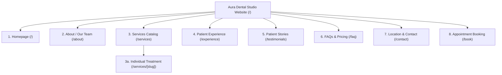
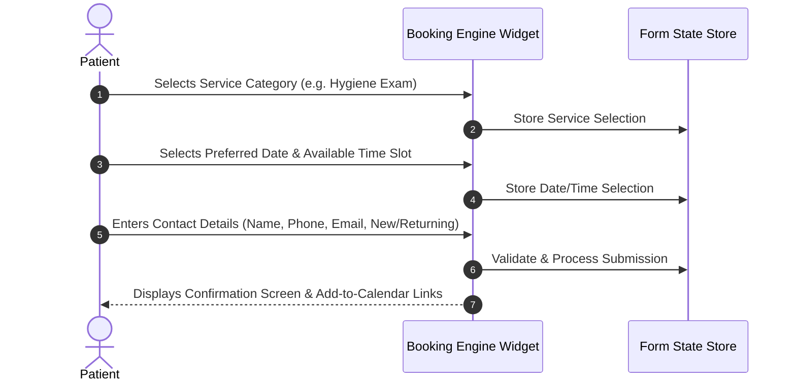

# Information Architecture & UX Blueprint: Aura Dental Studio

> **Document Status**: Approved Baseline  
> **Project Phase**: Phase 2 — Information Architecture & UX  
> **Target Application**: Dentist Portfolio Website (`dentist-portfolio-website`)

---

## 1. Website Sitemap & Information Architecture

The website hierarchy is structured to maximize conversion, establish immediate trust, and provide effortless navigation for both routine patients and specialty treatment seekers.



### Page Justification & Product Reasoning

| Route | Page Name | Target User | Primary Purpose | Primary CTA | Top-Level Nav? |
| :--- | :--- | :--- | :--- | :--- | :--- |
| `/` | **Homepage** | All prospective & returning patients | Establish premium positioning, build immediate trust, outline core services, and drive direct booking. | `Book Appointment` | Yes (Brand Entry) |
| `/about` | **About / Our Team** | Patients evaluating quality, credentials, and dentist empathy | Introduce Dr. Rostova & team, display qualifications, and detail clinical philosophy. | `Meet Our Dentists` / `Book Appointment` | Yes |
| `/services` | **Services Catalog** | Patients exploring treatment options or pricing structures | Provide organized overview of all 4 service categories (Preventive, Cosmetic, Restorative, Specialty). | `View Treatments` / `Book Appointment` | Yes |
| `/services/[slug]` | **Treatment Detail** | High-intent patients considering a specific procedure (e.g. Clear Aligners, Crowns) | Explain procedure steps, benefits, candidacy, recovery, and pricing range to convert hesitant leads. | `Book Consultation for [Service]` | Nested (under `/services`) |
| `/experience` | **Patient Experience & Comfort** | Anxious patients worried about pain, discomfort, or clinical intimidation | Showcase comfort amenities (headphones, sedation, warm towels) and walk through first visit expectations. | `Schedule a Gentle Exam` | Yes |
| `/testimonials` | **Patient Stories** | Skeptical patients seeking social proof and real community outcomes | Display verified reviews, before/after showcases, and patient video/written stories. | `Start Your Smile Journey` | Yes |
| `/faq` | **FAQs & Insurance** | Cost-conscious patients seeking insurance, payment, or policy answers | Provide clear answers regarding insurance acceptance, payment plans, cancellation, and safety. | `Check Your Coverage` / `Book Appointment` | Yes |
| `/contact` | **Location & Contact** | Patients looking for directions, office hours, parking, or phone contact | Provide address, interactive map, transit instructions, phone/email, and urgent care info. | `Call (512) 555-0199` / `Get Directions` | Yes |
| `/book` | **Appointment Booking** | High-intent patients ready to select date, time, and treatment | Streamlined 3-step interactive booking engine for immediate calendar reservation. | `Confirm Appointment` | Yes (Primary Button CTA) |

---

## 2. Navigation Architecture

### Header Navigation (Desktop)
* **Utility Top-Bar**:
  * Emergency Triage Call: `Emergency? Call (512) 555-0199`
  * Office Location & Hours: `410 Congress Ave, Suite 200, Austin, TX | Mon-Fri: 7:00 AM - 6:00 PM`
* **Main Header Bar**:
  * **Brand Logo**: `AURA DENTAL STUDIO` (Links to `/`)
  * **Nav Links**:
    * `About` (`/about`)
    * `Services` (`/services`) — *Dropdown with 4 categories: Preventive, Cosmetic, Restorative, Comfort/Specialty*
    * `Patient Experience` (`/experience`)
    * `Stories & Reviews` (`/testimonials`)
    * `FAQs & Pricing` (`/faq`)
    * `Contact` (`/contact`)
  * **Primary Header CTA**: `Book Online` (Accent button linking to `/book`)

### Mobile Navigation Structure
* **Sticky Top Navigation Bar**:
  * Compact Brand Logo (left)
  * Direct Phone Call Icon button (center-right)
  * Accessible Hamburger Menu toggle (`aria-expanded`, right)
* **Slide-over Mobile Drawer**:
  * Full list of primary routes with clear touch targets (minimum 48x48px)
  * Secondary contact details & clinic hours
  * Prominent full-width `Book Appointment` button at bottom of drawer

### Footer Navigation
* **Column 1 (Identity & Mission)**: Aura Dental Studio overview, doctor lead bio snippet, accreditation badges.
* **Column 2 (Quick Navigation)**: Home, About, Patient Experience, Testimonials, FAQs, Contact.
* **Column 3 (Service Highlights)**: Clear Aligners, Teeth Whitening, Same-Day Crowns, Dental Implants, Emergency Dentistry.
* **Column 4 (Contact & Hours)**: 410 Congress Ave, Suite 200, Austin, TX; Phone; Email; Opening Schedule.
* **Bottom Legal Strip**: Copyright © 2026 Aura Dental Studio, Fictional Portfolio Project Notice, Privacy Policy, Terms of Service, Accessibility Statement.

---

## 3. Route Map & Route Purpose

```text
/                          -> Homepage (Primary Landing & Value Proposition)
├── /about                 -> Doctor Bios, Team Credentials, Clinical Philosophy
├── /services              -> Categorized Treatment Catalog
│   ├── /services/clear-aligners    -> Treatment Detail: Clear Aligner Orthodontics
│   ├── /services/teeth-whitening   -> Treatment Detail: Professional Whitening
│   ├── /services/porcelain-veneers -> Treatment Detail: Porcelain Veneers
│   ├── /services/same-day-crowns   -> Treatment Detail: Same-Day Ceramic Crowns
│   ├── /services/dental-implants   -> Treatment Detail: Implants Restoration
│   ├── /services/preventive-hygiene-> Treatment Detail: Exams & Cleanings
│   └── /services/emergency-care    -> Treatment Detail: Urgent Care Triage
├── /experience            -> Comfort Amenities, Dental Anxiety Care, First Visit Walkthrough
├── /testimonials          -> Patient Reviews & Before/After Showcases
├── /faq                   -> Insurance PPO List, Payment Plans, Common Questions
├── /contact               -> Address, Interactive Map, Hours, Parking Guide, Contact Form
└── /book                  -> 3-Step Interactive Booking Engine Modal/Page
```

---

## 4. Page-by-Page Content Hierarchy

### Page 1: Homepage (`/`)
1. **Hero Section** (Priority: Critical)
   * *Purpose*: Communicate value proposition instantly and drive booking.
   * *Information*: Headline ("Modern, gentle dentistry designed around your comfort"), location badge ("Downtown Austin"), main image.
   * *Primary CTA*: `Book Appointment` | *Secondary CTA*: `Explore Treatments`
   * *Trust Role*: Immediate professional authority.
2. **Immediate Trust Bar** (Priority: High)
   * *Purpose*: Validate credibility within 5 seconds.
   * *Information*: Rating highlight (4.9/5 stars), 15+ years experience badge, same-day crown badge, zero-pressure care promise.
   * *Trust Role*: Social & technical proof.
3. **Core Services Grid** (Priority: High)
   * *Purpose*: Introduce primary service categories clearly.
   * *Information*: Preventive, Cosmetic, Restorative, Emergency cards with benefits and icons.
   * *Primary Action*: `View All Services` | *Secondary Action*: `Book Service`
4. **Dentist Spotlight** (Priority: High)
   * *Purpose*: Personalize care and introduce Dr. Elena Rostova.
   * *Information*: Doctor photo, DDS/FAGD credentials, personal care philosophy, warm welcome message.
   * *Action*: `Meet Our Team` (`/about`)
5. **Patient Experience & Comfort Feature** (Priority: Medium-High)
   * *Purpose*: Alleviate dental anxiety and highlight soothing amenities.
   * *Information*: Noise-canceling headphones, warm towels, painless ultrasonic hygiene.
   * *Action*: `Learn About Our Comfort Care` (`/experience`)
6. **"Your First Visit" 3-Step Walkthrough** (Priority: Medium)
   * *Purpose*: Eliminate fear of the unknown for new patients.
   * *Information*: 1. Warm Greeting & Amenities → 2. Gentle Exam & Digital Scans → 3. Transparent Care Plan.
7. **Patient Testimonials Carousel** (Priority: High)
   * *Purpose*: Provide community validation.
   * *Information*: Real patient quotes, star ratings, procedure context.
8. **Location, Hours & Interactive Map** (Priority: High)
   * *Purpose*: Confirm geographic convenience.
   * *Information*: 410 Congress Ave, map preview, parking garage directions, opening hours.
   * *Action*: `Get Directions`
9. **Final Conversion Banner** (Priority: Critical)
   * *Purpose*: Capture remaining intent at bottom of page.
   * *Information*: Reassuring closing statement + direct booking prompt.
   * *Primary CTA*: `Book Your Appointment Now`

---

## 5. User Flows & Decision Paths

```mermaid
flowchart TD
    subgraph Flow A [Routine Patient Booking Journey]
        A1[Organic Search / Direct Land] --> A2[Homepage Review]
        A2 --> A3[Check Doctor Credentials & Reviews]
        A4 --> A5[Select Date, Time, & Service]
        A3 --> A4[Click 'Book Appointment']
        A5 --> A6[Receive Instant Confirmation]
    end

    subgraph Flow B [Cosmetic Enquiry Journey]
        B1[Social Media / Ad Link] --> B2[Cosmetic Service Page]
        B2 --> B3[Review Procedure & Before/After]
        B3 --> B4[Click 'Request Consultation']
        B4 --> B5[Submit Enquiry Form]
        B5 --> B6[Concierge Follow-up]
    end

    subgraph Flow C [Urgent Mobile Visitor Triage]
        C1[Mobile Search: Emergency Dentist] --> C2[Mobile Landing Header]
        C2 --> C3[Tap Sticky 'Call Now' Bar]
        C3 --> C4[Direct Phone Triage Call]
    end
```



### Flow Recovery Matrix

| User Journey | Friction Point | Abandonment Risk | Recovery Path |
| :--- | :--- | :--- | :--- |
| **A. Routine Booking** | Unsure if insurance is accepted during step 2 of booking. | High (User exits tab) | Provide inline `View Accepted Insurance` link inside booking modal + instant phone assistance prompt. |
| **B. Cosmetic Enquiry** | Hesitation about price range for aligners or veneers. | Medium (User postpones decision) | Display transparent fee ranges with "Flexible Payment Options" toggle directly above consultation form. |
| **C. Mobile Urgent** | User browsing after office hours when phone is unanswered. | High (Emergency distress) | Display automated "After-Hours Triage Callback Request" form with guaranteed 7:00 AM next-morning priority call. |

---

## 6. Conversion Architecture & CTA Matrix

```text
CTA Hierarchy Structure
├── Tier 1: Primary Action (Accent Solid Button)  -> "Book Appointment" / "Confirm Slot"
├── Tier 2: Secondary Action (Outline / Ghost)    -> "Explore Services" / "Meet Team"
└── Tier 3: Utility Action (Text Link / Icon)     -> "Call (512) 555-0199" / "Get Directions"
```

### Page-Level CTA Placement Map

| Page | Primary CTA | Secondary CTA | Sticky CTA (Mobile) |
| :--- | :--- | :--- | :--- |
| **Homepage (`/`)** | `Book Appointment` (Hero & Footer Banner) | `Explore Treatments` (Hero) | `Call` + `Book Online` Bar |
| **About (`/about`)** | `Schedule Visit with Dr. Rostova` | `View Patient Comfort Care` | `Call` + `Book Online` Bar |
| **Services (`/services`)** | `Book Treatment Appointment` | `Request Consultation` | `Call` + `Book Online` Bar |
| **Service Detail (`/services/[slug]`)**| `Book [Service] Assessment` | `Ask a Question About [Service]` | `Call` + `Book [Service]` |
| **Experience (`/experience`)** | `Schedule Gentle First Visit` | `Read Patient Testimonials` | `Call` + `Book Online` Bar |
| **FAQs (`/faq`)** | `Book Your Appointment` | `Submit a Financial Question` | `Call` + `Book Online` Bar |
| **Contact (`/contact`)** | `Book Online Now` | `Call Office Directly` | `Call Now` Button |
| **Book (`/book`)** | `Confirm Booking` (Step 3) | `Back to Previous Step` | `Confirm Booking` |

---

## 7. 3-Step Booking Experience Blueprint

The booking flow operates as a focused, accessible modal or dedicated route (`/book`) designed to minimize friction while gathering necessary appointment criteria.



### Step Breakdown & Field Requirements

#### Step 1: Treatment & Reason Selection
* **Fields**:
  * Service Category Dropdown (Preventive Exam, Cosmetic Consultation, Restorative Care, Emergency Relief).
  * Patient Type Toggle (`New Patient` vs `Returning Patient`).
* **Validation**: Service category selection is required before proceeding to Step 2.

#### Step 2: Date & Time Slot Selection
* **Fields**:
  * Interactive Date Picker (Monday through Friday slots enabled).
  * Available Time Slots (Morning: 7:00 AM - 11:30 AM; Afternoon: 1:00 PM - 5:30 PM).
* **Validation**: Time slot selection is required to enable Step 3.

#### Step 3: Patient Information & Confirmation
* **Fields**:
  * First Name & Last Name (Required text).
  * Phone Number (Required, formatted `(XXX) XXX-XXXX`).
  * Email Address (Required email format).
  * Optional Notes / Specific Concerns (Optional text area).
* **Confirmation State**: Displays booking summary, confirmation code (`#AURA-XXXX`), office address, parking reminder, and `Add to Google Calendar` / `Add to Apple Calendar` actions.

---

## 8. Mobile UX Blueprint

```text
Mobile Viewport Priority Stack (320px - 768px)
┌─────────────────────────────────────────┐
│ Sticky Top Header (Logo + Call + Menu)   │
├─────────────────────────────────────────┤
│ Hero Value Prop & Immediate Action      │
├─────────────────────────────────────────┤
│ Single-Column Stacked Content Cards     │
├─────────────────────────────────────────┤
│ Touch-Optimized Accordions & Carousels   │
├─────────────────────────────────────────┤
│ Full-Width Footer & Contact Details     │
├─────────────────────────────────────────┤
│ Sticky Bottom Bar: [ Call ]  [ Book ]   │
└─────────────────────────────────────────┘
```

* **Mobile Touch Requirements**: Minimum 48x48px interactive target sizes for all buttons, form controls, and navigation items.
* **Sticky Bottom Action Bar**: Fixed at the bottom of mobile viewports, containing two equal-width buttons:
  1. `Call Us` (Triggers `tel:5125550199`).
  2. `Book Online` (Triggers `/book` modal).

---

## 9. Accessibility UX Specifications (WCAG 2.2 AA)

* **Keyboard Focus Order**: Logical tab sequence (`Skip to Content` link → Top bar utility → Header nav → Main hero → Page content → Footer nav).
* **Focus Indicators**: Visible 3px high-contrast focus rings around all active elements (`focus-visible:ring-2 focus-visible:ring-blue-600`).
* **ARIA Contracts**:
  * Navigation Menu: `aria-expanded="false/true"`, `aria-controls="mobile-menu"`.
  * Booking Modal: `role="dialog"`, `aria-modal="true"`, `aria-labelledby="modal-title"`, automatic focus trap inside modal when open.
  * FAQ Accordions: `aria-expanded="false/true"`, `aria-controls="faq-answer-N"`.
* **Reduced Motion**: Respects `prefers-reduced-motion: reduce` by disabling smooth scroll transitions and carousel auto-play.

---

## 10. SEO Information Architecture & Schema Strategy

| Route | Target Search Intent | Meta Title Direction | H1 Tag Target | Schema.org Type |
| :--- | :--- | :--- | :--- | :--- |
| `/` | Dentist Austin TX, Gentle Dental Studio | Aura Dental Studio \| Modern Gentle Dentistry Downtown Austin | Modern, Gentle Dentistry Designed Around Your Comfort | `Dentist`, `MedicalBusiness` |
| `/about` | Best Dentist Downtown Austin, Dr. Elena Rostova | Our Team & Dentists \| Aura Dental Studio Austin | Experienced, Compassionate Dental Care in Austin | `Physician`, `Person` |
| `/services` | Dental Services Austin, Cosmetic & Restorative Dental | Comprehensive Dental Services \| Aura Dental Studio | Patient-Centered Dental Treatments in Downtown Austin | `MedicalProcedure` |
| `/services/[slug]`| Clear Aligners Austin, Same Day Crowns Austin | [Treatment Name] in Austin, TX \| Aura Dental Studio | Advanced [Treatment Name] Services | `MedicalProcedure` |
| `/experience` | Dental Anxiety Dentist Austin, Painless Dentistry | Stress-Free Dental Experience & Comfort \| Aura Dental Studio | Your Comfort is Our First Priority | `MedicalWebPage` |
| `/faq` | Dentist Insurance Austin, Dental Payment Plans | Dental Insurance & FAQs \| Aura Dental Studio Austin | Transparent Financials & Patient FAQs | `FAQPage` |
| `/contact` | Dentist Near Me 78701, Congress Ave Dentist | Contact & Location \| Aura Dental Studio Downtown Austin | Visit Aura Dental Studio in Downtown Austin | `PostalAddress`, `LocalBusiness` |

---

## 11. Footer Architecture

```text
Footer Structure Overview
┌──────────────────────────────────────────────────────────────────┐
│ [Logo] Aura Dental Studio                                        │
│ Modern dentistry in downtown Austin.                             │
├───────────────┬──────────────────┬────────────────┬──────────────┤
│ Navigation    │ Treatments       │ Contact Info   │ Hours        │
│ • About Us    │ • Clear Aligners │ 410 Congress   │ Mon-Fri:     │
│ • Services    │ • Same-Day Crown │ Suite 200      │ 7am - 6pm    │
│ • Experience  │ • Whitening      │ Austin, TX     │ Sat: By Appt │
│ • Reviews     │ • Implants       │ (512) 555-0199 │ Sun: Closed  │
│ • FAQs        │ • Emergency Care │ info@aura...   │              │
├───────────────┴──────────────────┴────────────────┴──────────────┤
│ © 2026 Aura Dental Studio. Portfolio Demo. | Privacy | Terms      │
└──────────────────────────────────────────────────────────────────┘
```

---

## 12. Edge & Error State UX Blueprint

* **Booking Step 1 Unselected State**: `Next` button disabled with helper text: "Please select a service category to view available dates."
* **No Available Time Slots State**: Display message: "No online slots available for selected date. Please choose another date or call us directly at (512) 555-0199 for priority scheduling."
* **404 Route Not Found State**: Reassuring 404 page featuring a search bar, main page links, and a direct `Return to Homepage` CTA.
* **Form Validation Error State**: Clear inline red error messages below failing inputs (e.g., "Please enter a valid 10-digit phone number").

---

*This blueprint establishes the authoritative information architecture and UX structure for Phase 3+ design and frontend execution.*
