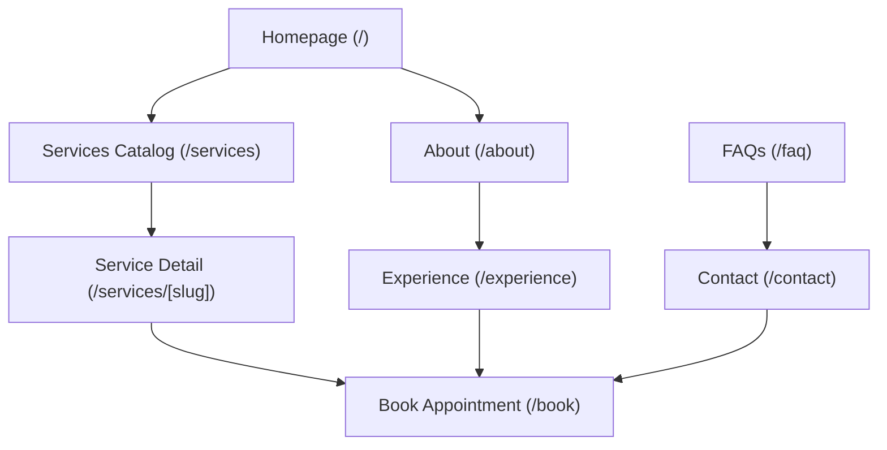

# Internal Pages Architecture: Aura Dental Studio

> **Document Status**: Approved Architecture Specification  
> **Project Phase**: Phase 7 — Internal Pages Architecture & Shared Page Patterns  
> **Target Application**: Dentist Portfolio Website (`dentist-portfolio-website`)

---

## 1. Internal Page Taxonomy & Taxonomy Matrix

To prevent duplicated layout code while preserving page identity, all internal routes are categorized into 6 distinct Page Types based on content intent and layout requirements:

```text
Internal Page Taxonomy Tree
├── TYPE A: Editorial Narrative Page    -> /about, /experience
├── TYPE B: Catalog & Directory Page    -> /services
├── TYPE C: Treatment Detail Page       -> /services/[slug]
├── TYPE D: Social Proof Showcase Page  -> /testimonials
├── TYPE E: Structured Information Page -> /faq
└── TYPE F: Access & Location Page      -> /contact
```

### Page Taxonomy Matrix

| Route | Page Type | Primary Objective | Target Audience | Primary CTA | Layout Pattern Family |
| :--- | :--- | :--- | :--- | :--- | :--- |
| `/about` | **TYPE A: Editorial Narrative** | Establish clinical authority, introduce Dr. Rostova & team, detail practice philosophy. | Patients evaluating dentist credentials & empathy | `Schedule Visit with Dr. Rostova` | PageHeader + EditorialSplit + BioGrid + CtaBanner |
| `/services` | **TYPE B: Catalog Directory** | Provide clean overview of all 4 service categories (Preventive, Cosmetic, Restorative, Specialty). | Patients exploring treatment options or fee ranges | `View Treatments` / `Book Service` | PageHeader + CategoryCards + CtaBanner |
| `/services/[slug]`| **TYPE C: Treatment Detail** | Explain procedure steps, benefits, suitability, pricing guidance, and FAQs for a specific service. | High-intent leads considering a specific procedure | `Book [Service] Assessment` | PageHeader + Breadcrumbs + EditorialSplit + ProcessSteps + ServiceFaq + CtaBanner |
| `/experience` | **TYPE A: Editorial Narrative** | Relieve dental anxiety by walking through comfort amenities, technology, and first visit flow. | Anxious or returning patients seeking gentle care | `Schedule Gentle Visit` | PageHeader + NarrativeSplit + AmenityGrid + ProcessSteps + CtaBanner |
| `/testimonials` | **TYPE D: Social Proof Showcase**| Provide community validation through portfolio demo reviews and before/after scenario showcases. | Skeptical patients seeking patient outcomes | `Start Your Smile Journey` | PageHeader + FeaturedStory + TestimonialGrid + DemoNotice + CtaBanner |
| `/faq` | **TYPE E: Structured Info** | Provide clear answers regarding insurance PPOs, payment plans, safety policies, and first visits. | Cost-conscious patients seeking financial/policy clarity | `Check Your Coverage` / `Book Appointment` | PageHeader + CategoryTabs + FaqAccordion + ContactPrompt + CtaBanner |
| `/contact` | **TYPE F: Access & Location** | Provide address, map guide, validated parking details, opening hours, phone line, and contact form. | Patients looking for directions or direct contact | `Call (512) 555-0199` / `Get Directions` | PageHeader + LocationSplit + ParkingCard + SimpleContactForm + CtaBanner |

---

## 2. Shared Page Template & Shell Strategy

```text
Shared Internal Page Architecture
┌────────────────────────────────────────────────────────┐
│ Global Header & Utility Bar (Sticky top)               │
├────────────────────────────────────────────────────────┤
│ PageHeader Primitive (Eyebrow + H1 + Subhead + Breadcrumb)│
├────────────────────────────────────────────────────────┤
│ Main Page-Specific Content Slot (Page Composition)     │
├────────────────────────────────────────────────────────┤
│ Contextual CtaBanner Primitive                         │
├────────────────────────────────────────────────────────┤
│ Global Footer                                          │
├────────────────────────────────────────────────────────┤
│ Mobile Sticky Action Bar (Mobile only)                 │
└────────────────────────────────────────────────────────┘
```

* **Boundary Rules**:
  * *Template Shell*: Manages global Header, PageHeader hero, CtaBanner footer entry, Footer, and MobileActionBar.
  * *Page Content Slot*: Receives structured local data and composes page-specific sections using shared component primitives.

---

## 3. Page-by-Page Architectural Specs

### 3.1 About Page (`/about`)
* **Purpose**: Answer *"Who are these people and why should I trust them?"*
* **Section Sequence**:
  1. `PageHeader`: Eyebrow: `OUR DENTISTS & TEAM` | H1: `Experienced, Compassionate Care Led by Clinical Excellence`.
  2. `EditorialSplit`: Dr. Elena Rostova's personal story, DDS/FAGD background, and conservative care philosophy.
  3. `BioGrid`: Profiles of Associate Dentist Dr. Marcus Vance, Lead Hygienist Sarah Jenkins, and Concierge Elena Martinez.
  4. `FeatureList`: Clinical standards, 3D technology investment, zero-pressure consultation promise.
  5. `CtaBanner`: `Schedule a Visit with Dr. Rostova`.

### 3.2 Services Catalog Page (`/services`)
* **Purpose**: Help patients navigate all 4 treatment categories efficiently.
* **Section Sequence**:
  1. `PageHeader`: Eyebrow: `TREATMENT CATALOG` | H1: `Comprehensive Dental Care Tailored to Your Lifestyle`.
  2. `CategoryGroup Grid`:
     * *Preventive & Hygiene Wellness* (Exams, Cleanings, Periodontal)
     * *Cosmetic & Smile Aesthetics* (Clear Aligners, Whitening, Veneers)
     * *Restorative Dentistry* (Same-Day Crowns, Implants, Fillings)
     * *Comfort & Specialty Care* (Night Guards, Emergency Triage)
  3. `FeeTransparencyPanel`: Upfront estimation process & insurance PPO acceptance guidance.
  4. `CtaBanner`: `Book Your Service Appointment`.

### 3.3 Service Detail Page (`/services/[slug]`)
* **Supported Slugs**: `preventive-hygiene`, `clear-aligners`, `teeth-whitening`, `porcelain-veneers`, `same-day-crowns`, `dental-implants`, `emergency-care`.
* **Section Sequence**:
  1. `Breadcrumbs`: `Home` → `Services` → `[Service Title]`.
  2. `PageHeader`: Eyebrow: `[CATEGORY] TREATMENT` | H1: `[Service Title] in Downtown Austin`.
  3. `EditorialSplit`: Treatment overview, patient benefits, candidacy criteria.
  4. `ProcessSteps`: 3-step step-by-step treatment procedure walkthrough.
  5. `FeeGuidanceBox`: Pricing range expectations, financing options, insurance coverage.
  6. `ServiceFaqAccordion`: 3–5 specific FAQs for this procedure.
  7. `RelatedServices`: 2–3 related treatment recommendations.
  8. `CtaBanner`: `Book Your [Service Title] Assessment`.

### 3.4 Experience Page (`/experience`)
* **Purpose**: Show what visiting Aura Dental Studio feels like and reduce dental anxiety.
* **Section Sequence**:
  1. `PageHeader`: Eyebrow: `STRESS-FREE CARE` | H1: `Designed to Eliminate Dental Anxiety`.
  2. `NarrativeSplit`: Why we built a calm, non-clinical boutique dental studio in Austin.
  3. `AmenityGrid`: Bose headphones, ultrasonic cleaning, warm towels, ergonomic memory foam chairs.
  4. `ProcessSteps`: Step-by-step first-visit concierge walkthrough.
  5. `CtaBanner`: `Schedule a Gentle Introductory Exam`.

### 3.5 Testimonials Page (`/testimonials`)
* **Purpose**: Provide community validation through portfolio demo reviews.
* **Section Sequence**:
  1. `PageHeader`: Eyebrow: `PATIENT STORIES` | H1: `Real Experiences from Austin Community Members`.
  2. `DemoNotice`: Clear portfolio demo disclosure (*Illustrative feedback for portfolio showcase*).
  3. `FeaturedStory`: In-depth patient transformation quote with before/after scenario description.
  4. `TestimonialGrid`: Categorized reviews (Hygiene, Cosmetic Aligners, Restorative Crowns).
  5. `CtaBanner`: `Start Your Smile Journey Today`.

### 3.6 FAQ Page (`/faq`)
* **Purpose**: Provide searchable/filterable answers regarding insurance, fees, and safety.
* **Section Sequence**:
  1. `PageHeader`: Eyebrow: `PATIENT FAQS & FINANCIALS` | H1: `Transparent Financials & Frequently Asked Questions`.
  2. `CategoryTabs`: Filter by *Insurance & Payment*, *First Visit*, *Cosmetic Treatments*, *Comfort & Safety*.
  3. `FaqAccordion`: Expandable question-and-answer accordions with keyboard support.
  4. `ContactPrompt`: *"Have a specific question not covered here?"* → Direct phone/concierge link.
  5. `CtaBanner`: `Book Your Appointment Online`.

### 3.7 Contact Page (`/contact`)
* **Purpose**: Answer *"How do I reach the clinic or get directions?"*
* **Section Sequence**:
  1. `PageHeader`: Eyebrow: `LOCATION & CONTACT` | H1: `Visit Aura Dental Studio in Downtown Austin`.
  2. `LocationSplit`: Address, studio hours, phone line, map visual anchor, parking garage details.
  3. `SimpleContactForm`: Contact concierge inquiry form (Name, Email, Phone, Preferred Time, Message).
  4. `CtaBanner`: `Call Us Directly at (512) 555-0199`.

---

## 4. Content Data Architecture

Local structured data modules in `src/lib/` supply content for internal pages:

```text
src/lib/
├── homepageData.ts              # Homepage datasets
├── servicesData.ts              # Full service catalog & detail specs
├── teamData.ts                  # Dentist bios, credentials, team profiles
├── faqData.ts                   # Categorized FAQ items & insurance PPO lists
└── testimonialData.ts           # Demo patient reviews & scenario stories
```

---

## 5. URL Routing & Navigation Architecture

```text
Route Map & Hierarchy
/                                -> Homepage
├── /about                       -> About & Team Narrative
├── /services                    -> Services Catalog Directory
│   ├── /services/clear-aligners -> Service Detail: Clear Aligners
│   ├── /services/same-day-crowns-> Service Detail: Same-Day Crowns
│   └── ...                      -> (Other treatment detail routes)
├── /experience                  -> Patient Comfort & Anxiety Relief
├── /testimonials                -> Demo Patient Stories
├── /faq                         -> FAQs & Insurance PPO List
└── /contact                     -> Location, Parking Guide & Contact Form
```

### Cross-Page Navigation Relationships



---

## 6. Internal CTA Architecture

- **Tier 1 (Primary Action)**: `Book Appointment` / `Schedule Visit` (Solid Forest Jade `#0D3B36`).
- **Tier 2 (Secondary Action)**: `View Treatments` / `Read Patient Stories` (Outline Soft Linen `#E7E2D8`).
- **Tier 3 (Utility Action)**: `Call (512) 555-0199` / `Get Directions` (Direct action link).

---

## 7. Responsive & Accessibility Rules

- **Responsive**: 1-column stack on mobile (320px–767px), 2-column split on tablet (768px–1023px), 12-column grid on desktop (1024px+). Mobile sticky action bar fixed at bottom on mobile viewports.
- **Accessibility (WCAG 2.2 AA)**: Unique `<h1>` per route, breadcrumb `<nav aria-label="Breadcrumb">`, accordion `aria-expanded` and `aria-controls` bindings, 3px visible focus rings, and explicit image alt text.

---

## 8. SEO & Structured Data Strategy

- **Schema.org JSON-LD Types**:
  - `/about`: `Physician`, `Person`
  - `/services`: `MedicalBusiness`
  - `/services/[slug]`: `MedicalProcedure`, `BreadcrumbList`
  - `/faq`: `FAQPage`
  - `/contact`: `PostalAddress`, `LocalBusiness`

---

## 9. Content & Claim Safety Rules

> [!IMPORTANT]
> Internal pages MUST strictly enforce demo content disclaimers:
> - Never present fictional ratings, credentials, or reviews as externally verified facts.
> - Include explicit portfolio demo notices on testimonials, metrics, and insurance carrier displays.

---

*This document establishes the authoritative internal pages architecture for Phase 8+ implementation.*
