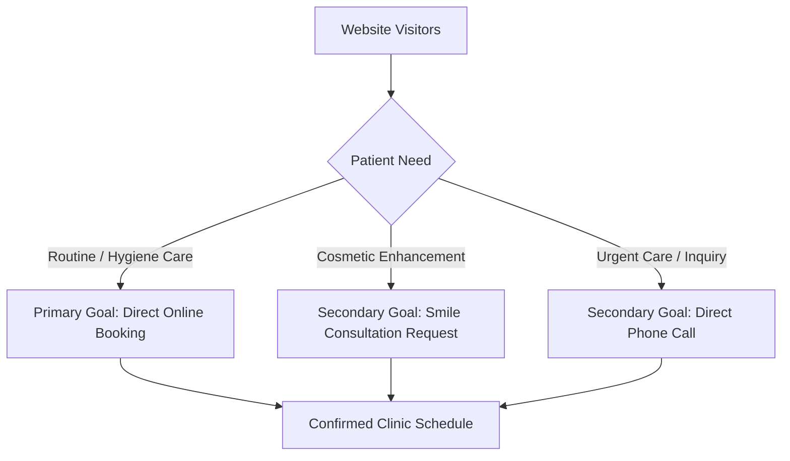
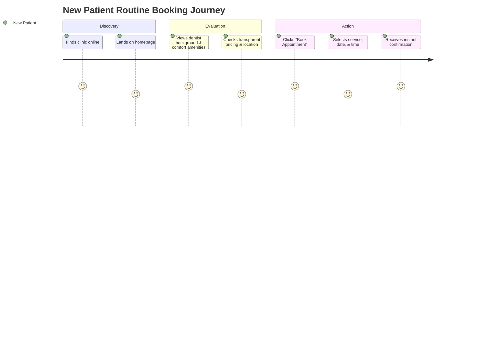

# Product Brief: Aura Dental Studio Website

> **Document Status**: Approved Baseline  
> **Project Phase**: Phase 1 — Product Definition  
> **Target Application**: Dentist Portfolio Website (`dentist-portfolio-website`)

---

## 1. Fictional Clinic Profile

### Clinic Identity
* **Clinic Name**: Aura Dental Studio
* **Location**: 410 Congress Avenue, Suite 200, Austin, TX 78701 (Downtown Arts & Business District)
* **Brand Positioning**: A modern, patient-centric boutique dental studio providing gentle preventive care, precision cosmetic enhancements, and stress-free restorative dentistry in a soothing, design-forward environment.
* **Clinic Personality**: Warm, professional, reassuring, transparent, aesthetic, and technologically advanced.
* **Approximate Size**: 4 dedicated treatment suites (operatories) and a comfortable patient consultation lounge.

### Team Structure
* **Dr. Elena Rostova, DDS, FAGD** — Founder & Lead Dentist (General & Cosmetic Dentistry)
* **Dr. Marcus Vance, DDS** — Associate General Dentist (Restorative & Implant Dentistry)
* **Sarah Jenkins, RDH** — Lead Dental Hygienist & Periodontal Care Coordinator
* **David Miller, RDH** — Dental Hygienist & Patient Educator
* **Elena Martinez** — Patient Care Coordinator & Treatment Concierge

### Target Patients
* Busy urban professionals needing efficient, punctual dental care.
* Adults seeking aesthetic smile enhancements (clear aligners, whitening, porcelain veneers).
* Patients with mild to moderate dental anxiety looking for a calm, non-clinical environment.
* Families residing or working in the central Austin area looking for long-term oral health partners.

### Service Spectrum
* **Primary Services**: Comprehensive Wellness Hygiene & Exams, Cosmetic Dentistry (Clear Aligners, Teeth Whitening, Veneers), Restorative Dentistry (Same-Day Crowns, Dental Implants, Tooth-Colored Fillings).
* **Secondary Services**: Emergency Dental Care, Preventive Children's Dentistry, Night Guards & Sleep Appliances.

### Differentiators
1. **Transparent & Upfront Pricing**: Clear cost estimates provided before treatment begins, with no unexpected post-visit fees.
2. **Comfort-First Amenity Bar**: Noise-canceling headphones, soothing warm towels, and gentle sedation options to ease dental anxiety.
3. **Same-Day Restoration Capabilities**: Modern digital scanning and in-house milling for single-visit ceramic crowns.
4. **Zero-Pressure Consultations**: Honest, informative treatment planning focused on long-term health rather than upselling.

### Primary Conversion Goal
* **Online Appointment Booking**: Enabling prospective and returning patients to reserve an appointment directly through a seamless 24/7 web interface.

---

## 2. Target Audience Analysis

### Primary Audience: "The Busy Urban Professional" (Ages 28–48)
* **Who They Are**: Tech-savvy professionals, executives, and creatives working or living near downtown.
* **What They Need**: Quick online scheduling, punctual appointment times, clear digital communication, and efficient care.
* **What Worries Them**: Wasted time in waiting rooms, hidden costs, inconvenient phone-only booking systems.
* **What Information They Look For**: Hours, location, dentist credentials, online booking availability, service overview.
* **What Prevents Booking**: Friction-heavy booking forms, lack of mobile responsiveness, requirement to call during work hours.
* **What Convinces Them**: 24/7 self-serve online booking, transparent policies, modern clinic aesthetic, strong reviews.
* **Desired Action**: Complete online booking for a routine checkup or hygiene session.

### Secondary Audience A: "The Aesthetic Seeker" (Ages 25–55)
* **Who They Are**: Individuals interested in enhancing their smile for personal or professional confidence.
* **What They Need**: Comprehensive information on cosmetic procedures, realistic visual examples, clear treatment timelines.
* **What Worries Them**: Artificial-looking results, permanent enamel damage, unexpected treatment costs.
* **What Information They Look For**: Cosmetic treatment details (aligners, whitening, veneers), step-by-step procedures, consultations.
* **What Prevents Booking**: Vague pricing ranges, clinical jargon, lack of clear procedure explanations.
* **What Convinces Them**: Realistic before/after showcases, dentist cosmetic training details, conservative treatment philosophy.
* **Desired Action**: Request a cosmetic smile consultation or book an initial assessment.

### Secondary Audience B: "The Anxious Returning Patient" (Ages 30–65)
* **Who They Are**: Individuals who have delayed dental visits due to past unpleasant experiences or fear of pain.
* **What They Need**: A gentle, non-judgmental environment, clear explanations of what will happen, pain-free techniques.
* **What Worries Them**: Physical discomfort, being lectured about delayed care, unexpected invasive procedures.
* **What Information They Look For**: Comfort amenities, gentle care philosophy, staff approach, patient reviews mentioning ease of visit.
* **What Prevents Booking**: Intimidating medical imagery, impersonal language, lack of comfort options.
* **What Convinces Them**: Empathetic tone, detailed "what to expect" guides, dentist bio emphasizing patient comfort.
* **Desired Action**: Contact the clinic via phone or web form to ask a question or schedule a gentle introductory exam.

---

## 3. Business Objectives & Conversion Strategy



### Hierarchy of Objectives

1. **Primary Objective: Direct Online Appointment Booking**
   * *Rationale*: Self-service booking converts high-intent visitors immediately into confirmed clinic calendar appointments, reducing front-desk administrative load and minimizing drop-off.
   * *KPI Target (Concept)*: Percentage of unique visitors initiating the booking flow who successfully complete appointment selection.

2. **Secondary Objective 1: Click-to-Call Direct Engagement**
   * *Rationale*: Essential for mobile users and patients needing immediate assistance or same-day emergency triage who prefer verbal confirmation.

3. **Secondary Objective 2: Cosmetic & Restorative Consultation Enquiries**
   * *Rationale*: Captures prospective patients considering multi-step treatments who need custom advice before committing to a clinical slot.

4. **Secondary Objective 3: Patient Education & Trust Building**
   * *Rationale*: Establishes long-term authority and reassurance, converting passive researchers into warm leads.

---

## 4. User Problems & Website Solutions

| User Problem | Cause / Pain Point | Website Solution |
| :--- | :--- | :--- |
| **Uncertainty About Quality & Care** | Generic websites with stock images and vague dentist credentials. | Feature authentic team backgrounds, professional facility showcases, and clear practice philosophy statements. |
| **Dental Anxiety & Fear of Pain** | Fear of clinical procedures, cold environments, or scolding by staff. | Dedicated "Patient Experience & Comfort" section detailing gentle techniques, soothing amenities, and step-by-step expectations. |
| **Unclear Pricing & Surprise Costs** | Hidden fees and lack of insurance / cost transparency. | Clear "Financial & Insurance" guide explaining upfront fee estimates, payment options, and accepted plans. |
| **Confusing Service Information** | Dense medical terminology that confuses patients. | Structured service catalog written in patient-centered language explaining "Who It Is For" and "Key Benefits". |
| **Booking Friction & Mobile Frustration** | Complex forms requiring desktop navigation or phone calls during work hours. | Mobile-first responsive design featuring a sticky quick-call button and a streamlined 3-step online booking widget. |

---

## 5. Website Value Proposition

* **Primary Value Proposition**: "Modern, gentle dentistry designed around your comfort, schedule, and confidence."
* **Supporting Value Propositions**:
  * *Transparent Care*: Clear treatment recommendations and upfront fee estimates with zero pressure.
  * *Comfort-First Approach*: Advanced gentle technology paired with soothing amenities for a stress-free visit.
  * *Comprehensive Expertise*: From preventive hygiene to complete aesthetic smile transformations under one roof.
* **Trust Proposition**: Real practitioner credentials, transparent care policies, patient-first philosophy, and clear step-by-step visit expectations.
* **Booking Proposition**: Fast 24/7 online appointment scheduling with instant confirmation and flexible morning/evening slots.

*Note: All claims in this portfolio brief represent a fictional demo environment and do not constitute actual medical claims or guaranteed clinical outcomes.*

---

## 6. Service Catalog Structure

```text
Service Catalog
├── 1. Preventive & Hygiene Wellness
│   ├── Comprehensive Oral Exam & Cleaning
│   └── Periodontal Maintenance & Screenings
├── 2. Cosmetic & Aesthetic Dentistry
│   ├── Clear Aligner Orthodontics
│   ├── Professional Teeth Whitening
│   └── Custom Porcelain Veneers
├── 3. Restorative Dentistry
│   ├── Same-Day Ceramic Crowns
│   ├── Dental Implants Restoration
│   └── Tooth-Colored Composite Fillings
└── 4. Comfort & Specialty Care
    ├── Customized Night Guards (Bruxism Relief)
    └── Emergency Dental Care
```

### Detailed Service Breakdowns

| Category | Service Name | Short Description | Patient Benefit | Target Audience | Tier | Detail Page Needed |
| :--- | :--- | :--- | :--- | :--- | :--- | :--- |
| **Preventive** | Comprehensive Exam & Cleaning | Thorough oral hygiene, digital X-rays, and gentle ultrasonic plaque removal. | Fresh breath, early cavity detection, and long-term tooth preservation. | All adult patients | Primary | Yes |
| **Preventive** | Periodontal Care & Cancer Screening | Gentle gum health assessment and non-invasive mucosal screening. | Protected gum foundation and peace of mind regarding oral health. | Patients with sensitive/bleeding gums | Secondary | Yes |
| **Cosmetic** | Clear Aligner Orthodontics | Discrete, removable transparent trays to align teeth smoothly over time. | Straighter teeth without the look or irritation of metal braces. | Adults & young professionals | Primary | Yes |
| **Cosmetic** | Professional Teeth Whitening | In-office laser whitening or custom-fitted home whitening kits. | Noticeably brighter smile in a single session or gentle home application. | Patients seeking fast smile enhancement | Primary | Yes |
| **Cosmetic** | Porcelain Veneers | Ultra-thin custom porcelain shells bonded to the front surface of teeth. | Corrects chips, discoloration, gaps, and asymmetry seamlessly. | Aesthetic enhancement seekers | Secondary | Yes |
| **Restorative** | Same-Day Ceramic Crowns | Single-visit digital scanning and precision milling of custom ceramic crowns. | Restores broken teeth in 1 visit without temporary crowns. | Busy patients with damaged teeth | Primary | Yes |
| **Restorative** | Dental Implants Restoration | Permanent tooth replacement anchored into the jaw with natural-looking crowns. | Functions and feels just like natural teeth for lifelong chewing confidence. | Patients with missing teeth | Secondary | Yes |
| **Restorative** | Tooth-Colored Fillings | Composite resin fillings matched to the exact shade of natural enamel. | Seamlessly repairs minor decay without dark metallic amalgam appearance. | General patients needing decay repair | Secondary | No (Included in Restorative) |
| **Specialty** | Night Guards & Bruxism Relief | Custom-molded protective guards worn during sleep to prevent teeth grinding. | Prevents jaw soreness, enamel wear, and morning tension headaches. | Patients who grind teeth or experience jaw tightness | Secondary | No (Included in Specialty) |
| **Specialty** | Emergency Dental Treatment | Same-day priority evaluation for acute tooth pain, broken teeth, or trauma. | Immediate pain relief and urgent stabilization when unexpected emergencies happen. | Patients experiencing acute dental distress | Secondary | Yes |

---

## 7. Trust Elements & Credibility Framework

| Trust Element | Why It Exists | Patient Doubt Reduced |
| :--- | :--- | :--- |
| **Practitioner Credentials & Bios** | Shows degrees, residency training, and professional association memberships. | Reduces doubt about dentist expertise, skill level, and competence. |
| **Care & Comfort Philosophy** | Explains the clinic's commitment to gentle, non-judgmental treatment. | Reduces fear of pain, anxiety, and being scolded for past dental neglect. |
| **Facility & Technology Showcase** | Highlights digital X-rays, 3D intraoral scanners, and comfortable operatories. | Reduces concern about outdated, painful, or slow dental procedures. |
| **Transparent Pricing & Insurance Guide** | Outlines fee structures, accepted insurance plans, and financing options. | Eliminates anxiety over unexpected bills or hidden treatment fees. |
| **Step-by-Step "Your First Visit" Guide** | Details what happens from arrival to check-out during the first appointment. | Eliminates fear of the unknown and reduces first-visit anxiety. |
| **Patient Testimonials & Reviews** | Displays authentic experiences from other community members. | Validates clinic reputation, staff friendliness, and appointment punctuality. |
| **Interactive Location & Parking Guide** | Provides clear transit directions, parking instructions, and landmark references. | Reduces frustration and uncertainty about arriving on time. |

---

## 8. Core User Journeys



### Journey A: New Patient Routine Booking
* **Entry Point**: Organic search or local map listing landing directly on Homepage.
* **Important Information Required**: Doctor credentials, clinic atmosphere, insurance acceptance, routine service options.
* **Decision Points**: Does this clinic look professional? Is it convenient? Is booking easy?
* **Friction Points**: Long forms, hidden costs, requirement to call during clinic hours.
* **Desired Action**: Click primary CTA (`Book an Appointment`) and complete time slot selection.
* **Successful Completion State**: Confirmed appointment notification displayed with calendar add button.

### Journey B: Cosmetic Treatment Enquiry
* **Entry Point**: Social link or targeted search landing on Cosmetic Dentistry section.
* **Important Information Required**: Clear aligner / whitening process, realistic before & after expectations, doctor aesthetic experience.
* **Decision Points**: Can they achieve the result I want? Is the process comfortable? Can I get a consultation first?
* **Friction Points**: Vague treatment explanations, missing process details, complex technical jargon.
* **Desired Action**: Submit a "Request Consultation" enquiry form with preferred time window.
* **Successful Completion State**: Confirmation message stating a concierge will contact them within 24 hours.

### Journey C: Mobile Urgent Visitor
* **Entry Point**: Search engine query "emergency dentist near me" on a mobile device.
* **Important Information Required**: Phone number, emergency availability, address, immediate pain relief capabilities.
* **Decision Points**: Can they see me today? How quickly can I contact them?
* **Friction Points**: Hard-to-find phone numbers, slow page load speeds, non-responsive buttons.
* **Desired Action**: Tap sticky `Call Now` button or submit a same-day emergency request.
* **Successful Completion State**: Immediate phone connection initiated to clinic front desk.

---

## 9. Functional Website Requirements

### MUST HAVE (Essential for Baseline MVP)
- [x] **Responsive Navigation Header**: Accessible top menu with logo, primary nav links, and persistent `Book Appointment` CTA.
- [x] **Primary Hero Section**: Clear value proposition, trust badges, and quick CTA entry points.
- [x] **Service Categorization Grid**: Clean presentation of primary and secondary services with concise descriptions.
- [x] **Dentist & Team Profile Section**: Practitioner photos, background credentials, and practice philosophy.
- [x] **Comfort & Technology Showcase**: Details on gentle care amenities and modern diagnostic tools.
- [x] **Step-by-Step "First Visit" Guide**: Clear walkthrough of patient onboarding expectations.
- [x] **Testimonials & Review Display**: Community feedback and trust indicators.
- [x] **Interactive Contact & Location Section**: Address, opening hours, interactive map view, and transit/parking directions.
- [x] **Mobile Sticky Actions**: Persistent quick-call and quick-book bar for mobile viewports.
- [x] **3-Step Appointment Booking Widget**: Interactive modal/flow allowing users to select service, date, and time slot.

### SHOULD HAVE (High Priority Enhancements)
- [ ] **Individual Treatment Detail Modals/Pages**: Deep-dive information for Clear Aligners, Same-Day Crowns, and Implants.
- [ ] **Filterable FAQ Section**: Categorized FAQs covering insurance, first visits, and procedure care.
- [ ] **Smile Consultation Enquiry Form**: Dedicated form for cosmetic inquiries with photo upload capability.
- [ ] **Financial & Insurance Guide**: Searchable table of accepted insurance providers and payment plans.

### NICE TO HAVE (Future Expansion)
- [ ] **Interactive Smile Self-Assessment Tool**: Quick questionnaire guiding users to suitable treatment categories.
- [ ] **Multi-language Support Toggle**: English / Spanish language switcher.
- [ ] **Virtual Office Tour**: 360-degree interactive photo gallery of the clinic space.

---

## 10. Non-Functional Requirements

* **Accessibility (a11y)**:
  * Strict adherence to WCAG 2.2 Level AA standards.
  * Full keyboard navigation support (`tabindex`, focus rings, `aria-expanded`, `aria-controls`).
  * Screen reader compatibility with semantic HTML5 tags and descriptive `aria-label` attributes.
  * Minimum color contrast ratio of 4.5:1 for standard text and 3:1 for large display headers.

* **Responsive Design**:
  * Seamless layout adaptation across viewports from 320px (mobile) to 2560px+ (ultra-wide monitors).
  * Touch-friendly targets (minimum 44x44px interactive areas) on mobile screens.

* **Performance & Core Web Vitals**:
  * Largest Contentful Paint (LCP) < 2.5 seconds.
  * First Input Delay (FID) / Interaction to Next Paint (INP) < 100ms.
  * Cumulative Layout Shift (CLS) < 0.1.
  * Zero layout jump during font loading using `next/font` optimization.

* **SEO & Semantic Architecture**:
  * Structured JSON-LD schema markup (`DentalClinic`, `MedicalProcedure`, `FAQPage`).
  * Unique meta titles and descriptions for every route.
  * Clean heading hierarchy (`<h1>` through `<h3>`) with zero skipped levels.

* **Maintainability & Engineering**:
  * Strict TypeScript mode (`noImplicitAny`, strict null checks).
  * Zero ESLint warnings or errors during production build.
  * Modular, single-responsibility component organization.

---

## 11. Content Inventory & Requirements

| Page / Section | Content Item | Status | Purpose / Description |
| :--- | :--- | :--- | :--- |
| **Homepage Hero** | Headline & Subhead | Required | Primary value proposition & clinic tagline |
| **Homepage Hero** | Hero Media Asset | Required | High-quality imagery of clinic interior / welcoming team |
| **Homepage Hero** | Primary CTA Buttons | Required | `Book Appointment` and `Explore Services` |
| **About / Team** | Dentist Bios & Photos | Required | Background, education, and patient care philosophy |
| **About / Team** | Clinic Amenities List | Required | Comfort offerings (headphones, warm towels, gentle care) |
| **Services Grid** | Treatment Cards | Required | Service title, 2-line summary, icon, and link |
| **Trust Section** | Patient Testimonials | Required | Quote, patient first name/initial, procedure type |
| **Trust Section** | Modern Tech Highlights | Required | Digital X-rays, intraoral scanners, 3D imaging |
| **Contact & Footer**| Location & Hours | Required | Full street address, phone, email, daily schedule |
| **Contact & Footer**| Parking & Directions | Required | Guidance on parking garage access & landmarks |
| **Booking Flow** | Service Selection Options| Required | Dropdown of primary treatments for appointment reservation |
| **Booking Flow** | Date/Time Picker Mock | Required | Interactive selection grid for appointment slots |
| **Treatment Detail**| Deep-Dive Text | Optional | Extended procedure steps, recovery guidance, FAQs |
| **Insurance Page** | Accepted Carriers List| Optional | Logotypes and list of covered PPO plans |

---

## 12. Success Criteria

1. **Clarity of Positioning**: A first-time visitor can identify clinic location, premium identity, and primary offerings within 5 seconds of landing.
2. **Frictionless Conversion Access**: The `Book Appointment` CTA is accessible from every viewport height via header, section banners, or mobile sticky bar.
3. **Reassuring UX Atmosphere**: Design choices, copy tone, and imagery convey calm, professional warmth without harsh medical jargon.
4. **Impeccable Mobile Usability**: All interactive buttons, forms, and scheduling steps operate smoothly on mobile touchscreens without pinch-zooming.
5. **Clean Production Standard**: 100% pass rate on TypeScript compilation, ESLint rules, and static build generation.

---

*This document serves as the authoritative specification for all subsequent Phase 2+ UX, layout, and frontend engineering tasks.*
